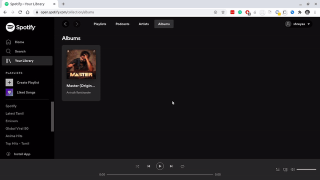

# Music Jump

Music Jump is a project that unifies different music streaming platforms in one place. It features migration of playlist and albums from one service to another. 

This repository contains code for the backend part of the application. The code for the front end is present in this [repository](https://github.com/shreyasseshadri/potential-invention/tree/master/webapp).

Services currently integrated into Music Jump:
- Amazon Music
- Spotify

Feature Progress
- [x] Music Explorer to explore your collections on all services
- [x] Migration of albums from Amazon to spotify
- [x] Migration of playlist from Amazon to spotify
- [ ] Caching of search results/ids
## Project Overview

### Our API

Our API exposes endpoints for authentication, exploring collections (Albums and Playlists), migration. Integration of the different Music services with our application is explained below.

#### Spotify API

Web APIs from [spotify](https://developer.spotify.com/documentation/web-api/reference/) are used to for features such as explorer and migration. Spotify authentication is mandatory for using these features.

#### Amazon Music Service

Since Amazon does not offer any public APIs, browser [extensions](https://github.com/shreyasseshadri/potential-invention/tree/master/extensions) have been used to get the necessary information for explorer and migration **from Amazon music**. This is the reason why the migration is not yet supported from another music service **to Amazon music**.

### Database

Currently, Redis is used as the database for our application.

## Demos

### Migrating album and playlist based on name

